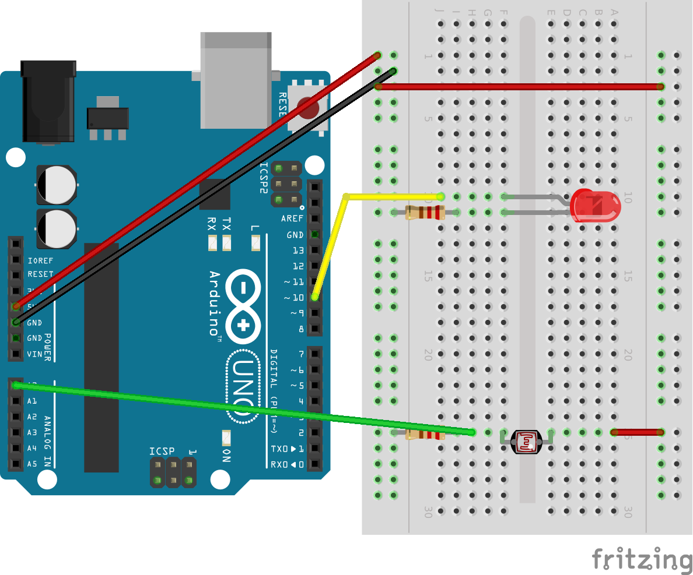

Arduino Computational Plasmid
=============================

## Introduction
Bacteria are versatile organisms able to dynamically respond to the stresses of the environment. This is made possible thanks to an organization of genetic information that is functionally and physically separate between basic information (contained within the bacterial cell) and other information easily exchangeable that may enter and exit the cell.The process of exchange genetic material is called Horizontal Gene Transfer (HGT).

One modality of HGT is the conjugation plasmid. Plasmids are DNA molecules not essential to the life of the bacterium. They can lead to bacterial characteristics that increase its chances of survival. Let’s imagine two bacteria belonging to the Escherichia Coli species (a model organism for the study of microbiology). The first, call it Colin, has plasmid for penicillin resistance, and the second, call it Kalin, is missing this plasmid. Their lives are quiet until the day when their environment encounters the antibiotic penicillin.

Without plasmids exchange, we will shortly see the survival of Colin, and the death of Kalin. But the two bacteria are able to combine: Colin replicates its plasmid with information to be resistant to penicillin, then approaches Kalin making a pilum (see image), that is a physical contact between the two cells. Through the pilum Kalin receives the plasmid copy  and becomes resistant to penicillin. Through conjugation, both bacteria will survive in spite of the presence of penicillin.

Inspired by the world of bacteria, we could distinguish between “resident” source code owned the device, similar to the bacterial chromosome, and the parts of the code can be transmitted between devices, similar to the plasmids. The "computational plasmid" may be easy transmitted between devices, easily integrated into the basic mechanism of operation of the device (or even completely disconnected from it) and bring additional functionality to vary the context of use of the device. An example of application could be the ability to use the device sensors for a purpose that is different from the original intent.

This project is an attempt to seed this concept and validate it. This could be used by makers, biologist or even K-12 and university professors to indagate differences in adaptive strategies between life and artificial systems.

You can read a more complete description of this project [here](http://www.mksens.com/the-source-code-of-the-bacteria-and-its-organization-suggestions). The article also include a comparison with github relatively to the transfer of code between projects.

This project was used during the talk "Makers as living ecosystem" ([slides](http://www.slideshare.net/SnapbackLabs/makers-as-a-living-ecosystem-light-talk-of-claudiuo-capobianco-a)) at the Maker Faire Rome 2014.

To simulate the Horizontal Genetic Transfer, we will need:
- two arduinos that simulate bacteria
- an Arduino to simulate the chemicals in the environment

## Make the Bacteria
Colin and Kalin are two bacteria. Colin has plasmid for penicillin resistance, and Kalin is missing this plasmid.

The bacteria chemoreceptors are simulated by the mean of the ambient light sensor.

To instantiate Colin or Kalin, you have to change the variable "myName" in the Arduino project.

### Schematics
Both bacteria has the same schematics.

  

### Body
To be more "realistic", you may build your bacteria using conductive play dough, look at [this video](https://www.youtube.com/watch?v=j_bkzjvlKTs).

## Make the Chemicals
To simulate penicillin in the environment, we use another Arduino with a blinking LED. In the project, we use also a toggle switch to turn on and off the precence of penicillin.

### Schematics

### Body
To easily transport and manipulate the environment Arduino, we placed all components in a half-liter plastic water bottle. Bottle is cut longitudinally and one part is removed. Breadboard with Arduino and all components is placed inside the bottle, and the LED is pulled out through the top hole of the bottle. To make the whole more stable, ww added beans on the lower part of the bottle.

## Simulate plasmid transfer between bacteria
(descrivere la demo)

# Final result

